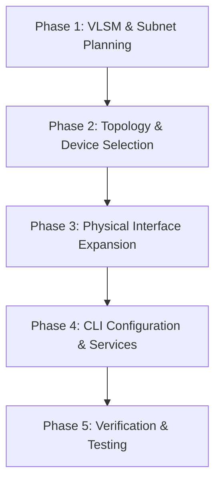

# Simple Office Network Design and Implementation Report

## 1. Introduction

A secure, reliable, and scalable network infrastructure is essential in today's business world. It ensures efficient resource sharing, smooth communication, and access to centralized services. As organizations grow, physical network layouts must evolve to provide functional segmentation while preserving a cohesive overall architecture.

This project report documents the design, simulation, and implementation of a comprehensive enterprise network for a multi-division corporate office. The network is configured using **Cisco Packet Tracer** and spans ten functional subnets, including administrative departments, engineering sections, a guest network, and a dedicated server infrastructure.

The core challenge of this implementation lies in partitioning a single private IP block, **192.168.10.0/24**, into ten separate logical subnets that satisfy specific host requirements with minimal address waste. To achieve this, **Variable Length Subnet Masking (VLSM)** is employed. In addition, **Open Shortest Path First (OSPF) Area 0** is used as the dynamic routing protocol to avoid the administrative burden of static routing in a multi-router architecture. The **Enterprise Core Hub Router** serves as the focal point of the WAN design, interconnecting all departmental routers. Centralized network services such as **DHCP** for dynamic address allocation, **DNS** for domain name resolution, and **HTTP**, **FTP**, and **SMTP** for application-layer services are hosted in a dedicated server zone and made accessible to all remote departments through **DHCP Relay**.

---

## 2. Objectives

The primary objectives of this network engineering project are:
1. **Efficient Address Allocation**: Perform VLSM subnetting on a single Class C IP address pool (`192.168.10.0/24`) to accommodate ten logical departments with varying host sizes, where the guest network takes 4x capacity (64 IPs) and the other networks take x capacity (16 IPs each).
2. **Hierarchical Topology Design**: Establish a structured, scalable network topology connecting multiple branch department switches to local gateway routers, which in turn connect to a centralized Core Hub Router.
3. **Dynamic Routing Convergence**: Configure OSPF (Area 0) dynamic routing across all network layer-3 devices to ensure complete reachability, fast network convergence, and dynamic routing updates without manual route configuration.
4. **Centralized Service Delivery**: Implement a dedicated Server Subnet hosting DHCP, DNS, HTTP, FTP, and SMTP servers to serve all users across the enterprise.
5. **Cross-Subnet Dynamic Addressing**: Configure DHCP Relay Agents (`ip helper-address`) on all remote division gateways, allowing client nodes in segregated subnets to automatically receive IP configuration from the central DHCP server.
6. **Physical Hardware Modification**: Analyze and execute hardware upgrades on Cisco routing platforms (adding `WIC-2T` serial interfaces, `WIC-1ENET` Ethernet expansion modules, and `NM-1S` network modules) to overcome physical port limitations.

---

## 3. Background Study

### 3.1 Variable Length Subnet Masking (VLSM)
Traditional subnetting divides an IP block into subnets of equal size. This leads to IP address waste when subnets have varying host requirements. VLSM solves this by applying different subnet masks to individual subnets, allowing a hierarchical arrangement of smaller subnets within a larger IP block. This optimizes address space efficiency and organizes subnets based on actual host capacity requirements.

### 3.2 Open Shortest Path First (OSPF)
OSPF is a link-state routing protocol designed for IP networks. Unlike distance-vector protocols (such as RIP), OSPF routers build a complete topological map of the network using Link State Advertisements (LSAs) and calculate the shortest path to all destinations using Dijkstra's Shortest Path First (SPF) algorithm. OSPF converges rapidly, supports VLSM, prevents routing loops, and is scalable. In this project, a Single-Area OSPF configuration (Area 0) is utilized, routing all internal and WAN links.

### 3.3 DHCP Relay (IP Helper-Address)
The Dynamic Host Configuration Protocol (DHCP) operates on broadcast messages to automatically assign IP configurations to client hosts. Because routers block broadcasts by design to prevent network congestion, clients in remote subnets cannot natively communicate with a DHCP server in a different subnet. A DHCP Relay Agent (`ip helper-address`) intercept these local broadcasts on the gateway interface and forwards them as unicast packets directly to the central DHCP server, facilitating centralized IP management.

### 3.4 Application Layer Services
- **Domain Name System (DNS)**: Translates human-readable domain names (e.g., `officewebsite.com`) into routable IP addresses.
- **File Transfer Protocol (FTP)**: Facilitates file sharing and storage between client machines and a central repository.
- **Simple Mail Transfer Protocol (SMTP)**: Handles electronic mail transmission across the organization.
- **Hypertext Transfer Protocol (HTTP)**: Hosts internal corporate intranet portals.

---

## 4. Methodology

The design and implementation of the enterprise network followed a structured, five-phase methodology.



### Phase 1: Variable Length Subnet Masking (VLSM) Calculations
To determine the allocation of IP addresses, we define the subnet sizing using the equation:
$$9x + 4x = 256$$
$$13x = 256$$

Network architecture relies on binary progression (standard blocks such as 16, 32, 64, or 128), meaning a 256-address pool won't divide cleanly by 13. To align with subnetting constraints, we identify the maximum power of 2 where the product of 13 and $x$ does not exceed 256:
- Selecting $x = 16$ results in 208 total addresses, providing a stable fit within the 256 limit while leaving remaining capacity.
- Utilizing the subsequent power ($x = 32$) would create 416 addresses, causing an immediate overflow of the available space.

Consequently, this calculation mandates /28 segments (16 IPs) for small subnets and a /26 block (64 IPs) for the primary network (Guest Network).

This leaves a leftover, unassigned IP space:
- Remaining range: `192.168.10.208` to `192.168.10.255` (48 total IPs).
- This can be safely left unallocated for future network expansions (e.g., adding three more /28 standard subnets later if needed).

### Phase 2: Topology Design and Device Selection
To connect the 10 local subnets, a Hub-and-Spoke topology was chosen. Six division-level routers serve as "spokes" that route traffic for their local LAN interfaces. These routers connect to a single **Enterprise Core Hub Router** via Serial WAN links, creating a centralized routing architecture.

- **Router 1 (Guest)**: Connects the Guest Network (/26).
- **Router 2 (Boss & HR Router)**: Connects the Boss & HR Subnet (/28).
- **Router 3 (Data Center Router)**: Connects the Server Switch (/28).
- **Router 4 (Revenue & Finance)**: Routes for Corporate Finance (/28) and Sales & Business Dev (/28).
- **Router 5 (Corporate Operations)**: Routes for Marketing & Comms (/28) and Logistics (/28).
- **Router 6 (IT & Engineering)**: Routes for Research & Development (/28), Senior Engineering (/28), and Junior/Intern Subnet (/28).
- **Router 7 (Core Hub Router)**: Interconnects Routers 1-6 using serial networks in the `20.0.0.0/8`, `30.0.0.0/8`, `40.0.0.0/8`, `50.0.0.0/8`, `60.0.0.0/8`, and `70.0.0.0/8` ranges.

### Phase 3: Physical Interface Expansion
Due to physical port limitations on standard router hardware, several hardware upgrades were simulated:
1. **IT & Engineering Router (Router 6)**: Needs to connect three separate local subnets (Subnets 8, 9, 10) in addition to its Serial WAN interface. Since standard Cisco 1841 routers contain only 2 built-in FastEthernet interfaces, a physical **WIC-1ENET** (1-port 10BaseT Ethernet card) was inserted into slot 0 to provide the third physical port (`Ethernet1/0`).
2. **Branch Routers (Routers 1-5)**: Equipped with **WIC-2T** (2-port Serial WAN Interface Cards) to establish WAN connectivity to the Core Hub.
3. **Core Hub Router (Router 7)**: This router requires 6 Serial WAN interfaces to connect all spoke routers. A standard Cisco 1841 router cannot support this density. We used a **PT Router (Router-PT)** and added three **NM-1S** (Single-Port Serial Network Modules) to provide 6 active serial ports.

### Phase 4: CLI Configuration and Service Integration
We configured interfaces, OSPF dynamic routing, and DHCP relay agents through the Cisco GUI and CLI. On the centralized server switch, we configured the DNS entries, HTTP web pages, FTP credentials, and SMTP email services.

---

## 5. Network Design

### 5.1 Topology Diagram
The physical design of this enterprise network consists of an Enterprise Core Hub Router linked to 6 division routers. Ten Catalyst 2960 switches connect local LAN users, and a cluster of centralized servers is installed on Subnet 3. This network architecture is primarily a **Tree topology** (also referred to as a **hierarchical tree topology**).

The simulated Cisco Packet Tracer network topology is shown below:


#### Topology Classification: Tree (Hierarchical) Topology
This network layout represents a **Tree Topology** organized in a hierarchical structure:
1. **Root Node (Core Layer)**: The **Enterprise Core Hub Router** acts as the root of the tree, serving as the central hub for WAN interconnection.
2. **Intermediate Branches (Distribution/Access Routers)**: The 6 branch division routers (Router 1 to Router 6) represent the first branch tier, connected to the root via WAN Serial links.
3. **Sub-Branches (Switches)**: The 10 Catalyst 2960 switches connect directly to their corresponding gateway routers.
4. **Leaf Nodes (Hosts/Servers)**: All client PCs, laptops, and centralized servers are connected to the switches, acting as the leaves of the tree structure.

---

### 5.2 Subnet Allocation Table
The following table shows the VLSM partitioning of the `192.168.10.0/24` range:

| Subnet ID | Subnet Name | Network Address | Subnet Mask / CIDR | First Usable IP | Usable IP Range | Broadcast Address | Total / Usable IPs | Default Gateway |
| :---: | :--- | :---: | :---: | :---: | :---: | :---: | :---: | :---: |
| **1** | Guest Network (4x Large) | 192.168.10.0 | 255.255.255.192 (/26) | 192.168.10.1 | 192.168.10.1 - 192.168.10.62 | 192.168.10.63 | 64 / 62 | 192.168.10.1 |
| **2** | Boss & HR Subnet | 192.168.10.64 | 255.255.255.240 (/28) | 192.168.10.65 | 192.168.10.65 - 192.168.10.78 | 192.168.10.79 | 16 / 14 | 192.168.10.65 |
| **3** | Server Switch Subnet | 192.168.10.80 | 255.255.255.240 (/28) | 192.168.10.81 | 192.168.10.81 - 192.168.10.94 | 192.168.10.95 | 16 / 14 | 192.168.10.81 |
| **4** | Corporate Finance Subnet | 192.168.10.96 | 255.255.255.240 (/28) | 192.168.10.97 | 192.168.10.97 - 192.168.10.110 | 192.168.10.111 | 16 / 14 | 192.168.10.97 |
| **5** | Sales & Business Dev Subnet | 192.168.10.112 | 255.255.255.240 (/28) | 192.168.10.113 | 192.168.10.113 - 192.168.10.126 | 192.168.10.127 | 16 / 14 | 192.168.10.113 |
| **6** | Marketing, Comms & Content | 192.168.10.128 | 255.255.255.240 (/28) | 192.168.10.129 | 192.168.10.129 - 192.168.10.142 | 192.168.10.143 | 16 / 14 | 192.168.10.129 |
| **7** | Logistics Access Subnet | 192.168.10.144 | 255.255.255.240 (/28) | 192.168.10.145 | 192.168.10.145 - 192.168.10.158 | 192.168.10.159 | 16 / 14 | 192.168.10.145 |
| **8** | Research & Dev Access Subnet | 192.168.10.160 | 255.255.255.240 (/28) | 192.168.10.161 | 192.168.10.161 - 192.168.10.174 | 192.168.10.175 | 16 / 14 | 192.168.10.161 |
| **9** | Senior Engineering Subnet | 192.168.10.176 | 255.255.255.240 (/28) | 192.168.10.177 | 192.168.10.177 - 192.168.10.190 | 192.168.10.191 | 16 / 14 | 192.168.10.177 |
| **10** | Junior/Intern Subnet | 192.168.10.192 | 255.255.255.240 (/28) | 192.168.10.193 | 192.168.10.193 - 192.168.10.206 | 192.168.10.207 | 16 / 14 | 192.168.10.193 |
| **-** | *Unallocated Expansion Pool* | *192.168.10.208* | *255.255.255.240 (/28)* | *N/A* | *192.168.10.208 - 192.168.10.255* | *192.168.10.255* | *48 / 42* | *N/A* |

---

### 5.3 Router WAN Connection & Interface Table
The WAN links connecting spoke routers to the Core Hub use `/8` address blocks for serial point-to-point simulation in Packet Tracer:

| Router Name | LAN Interface(s) | LAN IP Address | WAN Interface | WAN IP Address | Peer (Core Hub) Interface & IP | OSPF Area |
| :--- | :--- | :--- | :--- | :--- | :--- | :---: |
| **Router 1** (Guest Router) | FastEthernet0/0 | 192.168.10.1 /26 | Serial0/0/0 | 20.0.0.2 /8 | Serial0/0 (20.0.0.1) | 0 |
| **Router 2** (Broadcast Router) | FastEthernet0/0 | 192.168.10.65 /28 | Serial0/0/0 | 30.0.0.2 /8 | Serial1/0 (30.0.0.1) | 0 |
| **Router 3** (Data Center Router) | FastEthernet0/0 | 192.168.10.81 /28 | Serial0/0/0 | 40.0.0.2 /8 | Serial2/0 (40.0.0.1) | 0 |
| **Router 4** (Revenue & Finance Router) | FastEthernet0/0<br>FastEthernet0/1 | 192.168.10.97 /28<br>192.168.10.113 /28 | Serial0/0/0 | 50.0.0.2 /8 | Serial3/0 (50.0.0.1) | 0 |
| **Router 5** (Corporate Ops Router) | FastEthernet0/0<br>FastEthernet0/1 | 192.168.10.129 /28<br>192.168.10.145 /28 | Serial0/0/0 | 60.0.0.2 /8 | Serial4/0 (60.0.0.1) | 0 |
| **Router 6** (IT & Eng Division Router) | FastEthernet0/0<br>FastEthernet0/1<br>Ethernet1/0 | 192.168.10.161 /28<br>192.168.10.177 /28<br>192.168.10.193 /28 | Serial0/0/0 | 70.0.0.2 /8 | Serial5/0 (70.0.0.1) | 0 |
| **Router 7** (Enterprise Core Hub) | N/A | N/A | Serial0/0<br>Serial1/0<br>Serial2/0<br>Serial3/0<br>Serial4/0<br>Serial5/0 | 20.0.0.1 /8<br>30.0.0.1 /8<br>40.0.0.1 /8<br>50.0.0.1 /8<br>60.0.0.1 /8<br>70.0.0.1 /8 | Se0/0/0 of R1 (20.0.0.2)<br>Se0/0/0 of R2 (30.0.0.2)<br>Se0/0/0 of R3 (40.0.0.2)<br>Se0/0/0 of R4 (50.0.0.2)<br>Se0/0/0 of R5 (60.0.0.2)<br>Se0/0/0 of R6 (70.0.0.2) | 0 |

---

## 6. Hardware and Software Requirements

### 6.1 Software Requirements
- **Network Simulator**: **Cisco Packet Tracer** (latest available version used for this project).
- **Host Simulation Tools**: Packet Tracer GUI and CLI tools.
- **Operating System**: **Ubuntu 24.04.4 LTS** and **Windows 11**.

### 6.2 Hardware Devices and Specifications (Simulated)
1. **Enterprise Core Hub Router (1 Unit)**: 
   - Model: Cisco PT-Router (`Router-PT`).
   - Network Modules: Added 3 x `NM-1S` single-port serial modules to accommodate 6 active WAN Serial interfaces.
2. **Branch Division Routers (6 Units)**:
   - Model: Cisco 1841.
   - Expansion Cards: 5 x `WIC-2T` 2-port Serial cards inserted.
   - Specialized Module: 1 x `WIC-1ENET` single-port Ethernet expansion module (installed on Router 6 to provide the `Ethernet1/0` interface).
3. **LAN Switches (10 Units)**:
   - Model: Cisco Catalyst 2960.
4. **Centralized Enterprise Servers (6 Units)**:
   - Model: Cisco `Server-PT` customized for respective network services (DHCP, DNS, HTTP, FTP, Operator, SMTP).
5. **Client Devices (42 Units)**:
   - Model: Cisco `PC-PT` and `Laptop-PT` devices distributed across subnets to test dynamic IP acquisition and end-to-end communication.
6. **Physical Cabling Standards**:
   - **Copper Straight-Through (Category 6)**: Used to connect PC interfaces to Switch ports, and Switch ports to Router FastEthernet/Ethernet interfaces.
   - **Serial DCE (Data Communication Equipment)**: Used on the WAN connections to link branch routers to the Core Hub, establishing clock rates on the Core Hub interfaces.

---

## 7. Implementation

### 7.1 Router Configurations

All physical LAN and WAN interfaces, including IP address assignments, subnet masks, default gateways, DHCP relay configurations with `ip helper-address 192.168.10.82`, and interface status commands, were configured using the Graphical User Interface Config tab in Cisco Packet Tracer.

To enable dynamic packet routing, **OSPF dynamic routing** was configured on each router via the Command Line Interface (CLI). Below are the OSPF CLI configuration scripts executed:

#### Guest Network Router
```router-config
Router> enable
Router# configure terminal
Router(config)# router ospf 1
Router(config-router)# network 192.168.10.0 0.0.0.63 area 0
Router(config-router)# network 20.0.0.0 0.255.255.255 area 0
```

#### Broadcast Router (Boss & HR)
```router-config

Router(config)# router ospf 2
Router(config-router)# network 192.168.10.64 0.0.0.15 area 0
Router(config-router)# network 30.0.0.0 0.255.255.255 area 0
```

#### Enterprise Data Center Router
```router-config

Router(config)# router ospf 3
Router(config-router)# network 192.168.10.80 0.0.0.15 area 0
Router(config-router)# network 40.0.0.0 0.255.255.255 area 0
```

#### Revenue & Finance Division Router
```router-config

Router(config)# router ospf 4
Router(config-router)# network 192.168.10.96 0.0.0.15 area 0
Router(config-router)# network 192.168.10.112 0.0.0.15 area 0
Router(config-router)# network 50.0.0.0 0.255.255.255 area 0
```

#### Corporate Operations Division Router
```router-config

Router(config)# router ospf 5
Router(config-router)# network 192.168.10.128 0.0.0.15 area 0
Router(config-router)# network 192.168.10.144 0.0.0.15 area 0
Router(config-router)# network 60.0.0.0 0.255.255.255 area 0
```

#### IT & Engineering Division Router
```router-config

Router(config)# router ospf 6
Router(config-router)# network 192.168.10.160 0.0.0.15 area 0
Router(config-router)# network 192.168.10.176 0.0.0.15 area 0
Router(config-router)# network 192.168.10.192 0.0.0.15 area 0
Router(config-router)# network 70.0.0.0 0.255.255.255 area 0
```

#### Enterprise Core Hub Router
```router-config

Router(config)# router ospf 7
Router(config-router)# network 20.0.0.0 0.255.255.255 area 0
Router(config-router)# network 30.0.0.0 0.255.255.255 area 0
Router(config-router)# network 40.0.0.0 0.255.255.255 area 0
Router(config-router)# network 50.0.0.0 0.255.255.255 area 0
Router(config-router)# network 60.0.0.0 0.255.255.255 area 0
Router(config-router)# network 70.0.0.0 0.255.255.255 area 0
```

---

### 7.2 Centralized Server Configurations

The dedicated Server Subnet (Subnet 3) houses the following configurations:

1. **DNS Server**:
   - **IP Address**: `192.168.10.88`
   - **Subnet Mask**: `255.255.255.240`
   - **Default Gateway**: `192.168.10.81`
   - **Domain Mapping**: Resolves `officewebsite.com` -> `192.168.10.85`.
2. **HTTP Server (Web Server)**:
   - **IP Address**: `192.168.10.85`
   - **Subnet Mask**: `255.255.255.240`
   - **Default Gateway**: `192.168.10.81`
   - **DNS Configuration**: Set to `192.168.10.88`
   - **Service Content**: Simple corporate index website demonstrating access.
3. **FTP Server**:
   - **IP Address**: `192.168.10.83`
   - **Subnet Mask**: `255.255.255.240`
   - **Default Gateway**: `192.168.10.81`
   - **Credentials**:
     - Username: `admin` | Password: `admin` (Full Read, Write, Delete, Rename, List permissions)
     - Username: `user` | Password: `user` (Read and List permissions)
4. **SMTP Server**:
   - **IP Address**: `192.168.10.84`
   - **Subnet Mask**: `255.255.255.240`
   - **Default Gateway**: `192.168.10.81`
   - **Service Configuration**: Configured with a default domain, creating test mailboxes for users.
5. **Operator Node**:
   - **IP Address**: `192.168.10.86`
   - **Subnet Mask**: `255.255.255.240`
   - **Default Gateway**: `192.168.10.81`
6. **DHCP Server**:
   - **IP Address**: `192.168.10.82`
   - **Subnet Mask**: `255.255.255.240`
   - **Default Gateway**: `192.168.10.81`
   - **Dynamic IP Pool Configuration**: Set up pools for all 9 non-server subnets. 

The DHCP server configuration pools are detailed below:

| Pool Name | Gateway IP | DNS Server | Start IP Address | Subnet Mask | Maximum Users |
| :--- | :---: | :---: | :---: | :---: | :---: |
| **Guest_Pool** | 192.168.10.1 | 192.168.10.88 | 192.168.10.2 | 255.255.255.192 | 60 |
| **Boss_HR_Pool** | 192.168.10.65 | 192.168.10.88 | 192.168.10.66 | 255.255.255.240 | 12 |
| **Corp_Finance_Pool** | 192.168.10.97 | 192.168.10.88 | 192.168.10.98 | 255.255.255.240 | 12 |
| **Sales_Pool** | 192.168.10.113 | 192.168.10.88 | 192.168.10.114 | 255.255.255.240 | 12 |
| **Marketing_Pool** | 192.168.10.129 | 192.168.10.88 | 192.168.10.130 | 255.255.255.240 | 12 |
| **Logistics_Pool** | 192.168.10.145 | 192.168.10.88 | 192.168.10.146 | 255.255.255.240 | 12 |
| **RD_Pool** | 192.168.10.161 | 192.168.10.88 | 192.168.10.162 | 255.255.255.240 | 12 |
| **Senior_Eng_Pool** | 192.168.10.177 | 192.168.10.88 | 192.168.10.178 | 255.255.255.240 | 12 |
| **Junior_Intern_Pool** | 192.168.10.193 | 192.168.10.88 | 192.168.10.194 | 255.255.255.240 | 12 |

---

## 8. Testing and Verification

To verify that the network topology is fully functional and optimized, we ran testing scenarios focusing on IP address lease allocation, end-to-end routing, and application layer interaction.

### 8.1 DHCP Lease Verification
When a client PC boots in any division, it requests an IP address through DHCP:


A random laptop in the guest network received a valid IP configuration from the Guest subnet pool.

Result interpretation: This confirms that DHCP is functioning correctly for the guest subnet and that the router is successfully forwarding DHCP requests to the centralized DHCP server through the configured relay agent.


A random PC in the Sales department also received a valid IP configuration from its assigned subnet pool.

Result interpretation: This verifies that centralized DHCP allocation works across remote departmental subnets and proves that the `ip helper-address` configuration is operating correctly beyond the local server subnet.

---

### 8.2 End-to-End Connectivity (Ping & Traceroute)
Using the Cisco Packet Tracer message simulator, packets were sent from one network to another to verify inter-subnet communication.


Result interpretation: The successful packet flow in the simulator demonstrates that OSPF learned the required routes and that traffic can move correctly between separate subnets through the hub-and-spoke WAN design.


Result interpretation: This additional test confirms stable end-to-end communication between another pair of nodes, showing that routing consistency is maintained across multiple departments rather than only a single path.

---

### 8.3 DNS & Web Portal Access (HTTP)
From any device, the internal web browser was launched to request the URL `officewebsite.com` instead of entering a raw IP address:


Result interpretation: The successful page load confirms that DNS resolution is working properly and that the HTTP server is reachable from client devices across the routed enterprise network.

---

### 8.4 FTP Server Authentication and Command Execution
A client host opened the FTP client through the command prompt and connected to `192.168.10.83` using valid user credentials:


All commands such as `get`, `put`, `delete`, and `dir` were executed successfully.

Result interpretation: This confirms that the FTP service is reachable across the network, user authentication is functioning correctly, and file operations can be performed according to the configured permissions.

---

### 8.5 SMTP Server

A host sent mail to another host after both devices were configured with valid email accounts.


All messages were sent successfully.

Result interpretation: This demonstrates that the SMTP-based mail service is operational, user mail configuration is correct, and application-layer communication works across different hosts in the enterprise network.

---

## 9. Challenges Faced

1. **Subnetting Contradiction & Limits**: Dividing a standard Class C pool (`192.168.10.0/24`) to accommodate exactly 13 logical portions ($9x + 4x = 13x$) requires binary boundaries. Using standard 32-IP blocks ($x=32$) caused an immediate pool overflow ($13 \times 32 = 416 > 256$). This was resolved by reducing the block size to $x=16$, aligning the small subnets with $/28$ structures and the large network with a $/26$ subnet, which safely fits within the Class C boundary.
2. **Spoke Router Physical Interface Constraints**: Cisco 1841 routers only contain two fixed FastEthernet slots. However, the IT & Engineering Router (Router 6) needed to manage three distinct local segments (R&D, Senior Engineering, and Junior/Intern) in addition to its Serial WAN interface. This was resolved by installing a `WIC-1ENET` card into Slot 0 to add a third physical interface (`Ethernet1/0`).
3. **Core Hub Router Density Limits**: Connecting 6 separate serial connections to a single Cisco 1841 router is physically impossible. This was resolved by selecting a modular Cisco PT-Router (`Router-PT`) for the core hub, allowing us to install three dual-slot `NM-1S` serial network modules to support the 6 WAN interface connections.
4. **DHCP Relay Configuration**: Initial tests failed to lease IPs to spoke clients because router interfaces dropped client broadcast packets. We resolved this by configuring `ip helper-address 192.168.10.82` on all gateway FastEthernet/Ethernet interfaces, forwarding the broadcast DHCP requests to the server as unicast packets.

---

## 10. Future Improvements

1. **VLAN Implementation (IEEE 802.1Q)**: Rather than assigning physical router ports to individual subnets, we can implement Virtual LANs (VLANs) and Inter-VLAN routing (Router-on-a-Stick or Layer 3 Switches) to route multiple departments over a single physical link, lowering overall hardware costs.
2. **Access Control Lists (ACLs)**: Implement ACLs on router interfaces to block Guest Network nodes from accessing confidential internal subnets (e.g., Corporate Finance and Server databases).
3. **IPv6 Transition**: Design an IPv6 addressing scheme to prepare the enterprise network for the eventual exhaustion of public IPv4 addresses, mapping `/64` subnets to departments.
4. **Quality of Service (QoS)**: Prioritize hosts based on their roles so that critical departments and services receive better traffic handling during congestion.

---

## 11. Conclusion

This project successfully designed, simulated, and verified a multi-department enterprise network using Cisco Packet Tracer. By employing Variable Length Subnet Masking (VLSM), a Class C IP address pool (`192.168.10.0/24`) was optimized to fit 10 distinct subnets with host allocations of varying scales, leaving 48 IP addresses free for future expansion. 

Implementing OSPF dynamic routing (Area 0) across a central configuration eliminated the need for static route tables and ensured fast convergence. Additionally, configuring DHCP relay agents enabled central IP management. Finally, tests verified that clients could successfully resolve URLs via DNS, access the intranet HTTP site, log in to the FTP repository, and communicate across the network.

---

## 12. References

1. **Md Soyebuzaman Naim (2026)**. *Computer Networking Lab*. Video playlist https://www.youtube.com/playlist?list=PLGMpQlNaXg2_Y4n17Zwjutd9gyaQ-ehLI
